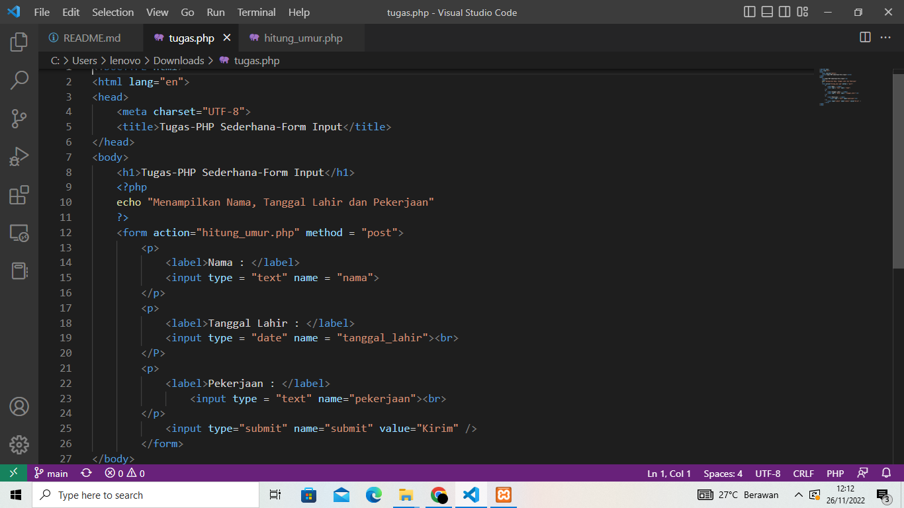
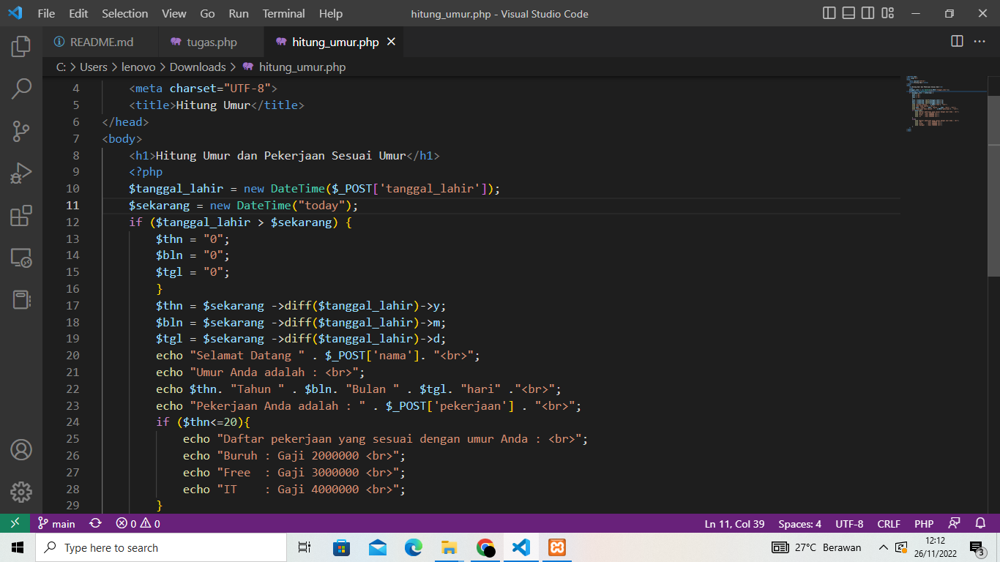
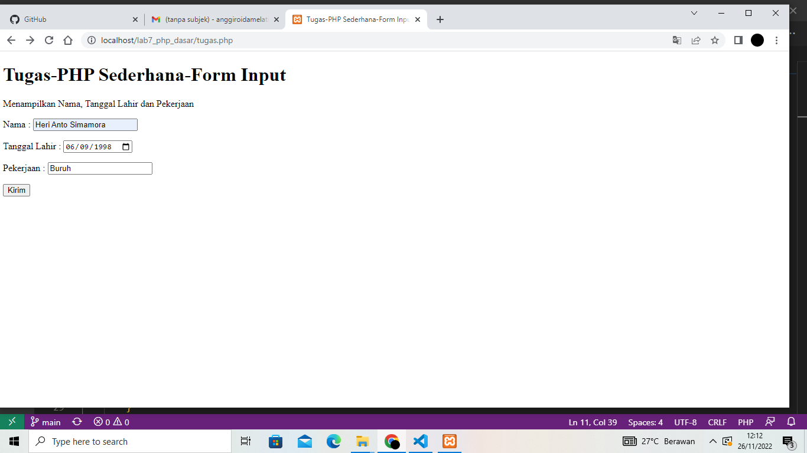
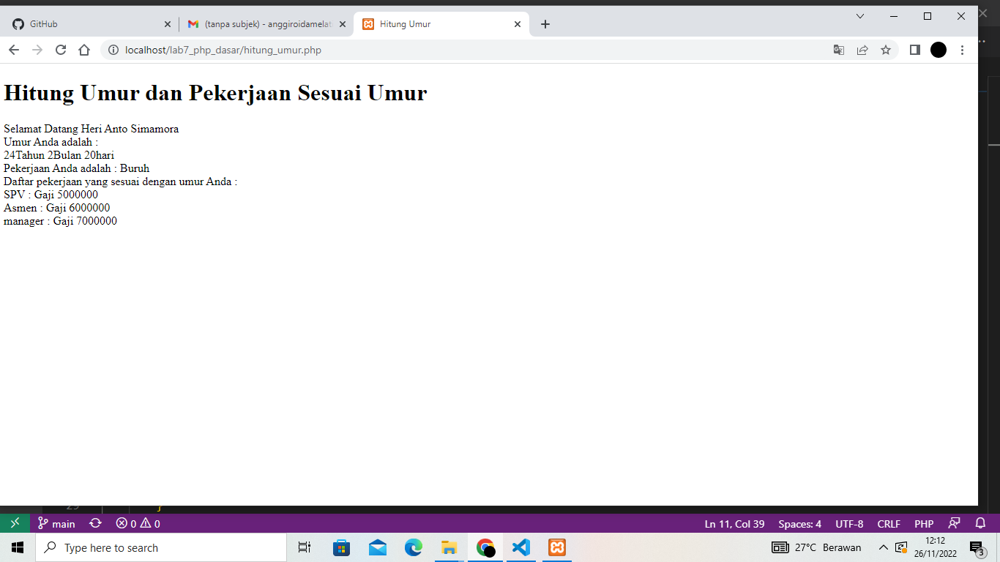

# Lab7Web

# TUGAS 7

| Nama | kelas | Nim | Matkul |
| -- | --- | ---- | ----------- |
| Heri Anto Simamora | TI.21.B.2| 312110365 | Perograman Web |

## PHP DASAR

## VARIABLE PHP

## Predefine Variable $_GET

## MEMBUAT FORM INPUT

### OPERATOR

### KONDISI IF 

### KONDISI SWITCH

### PERULANGAN FOR

### PERULANGAN WHILE

### PERULANGAN DOWNHILE

## TUGAS

